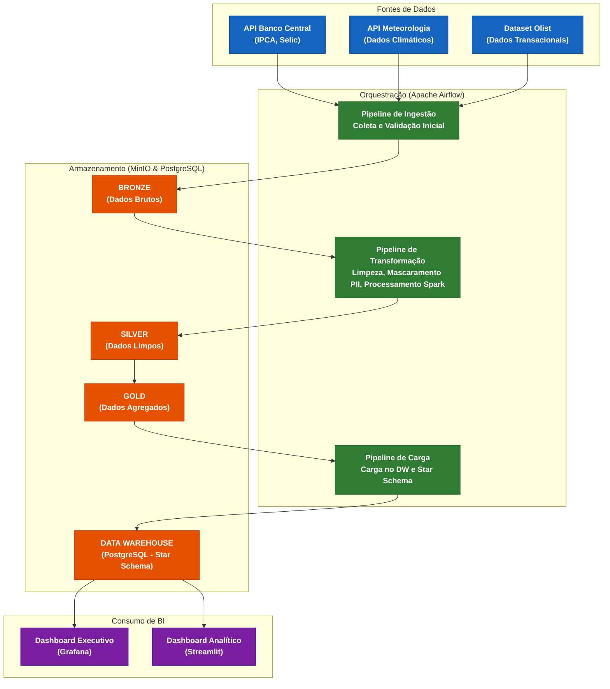
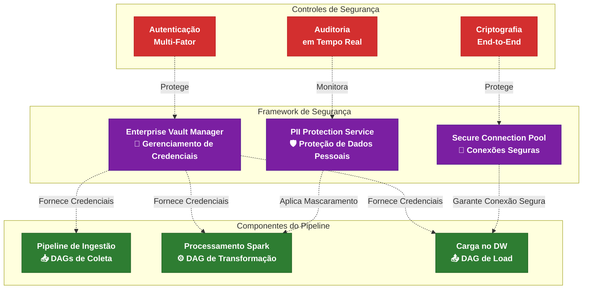
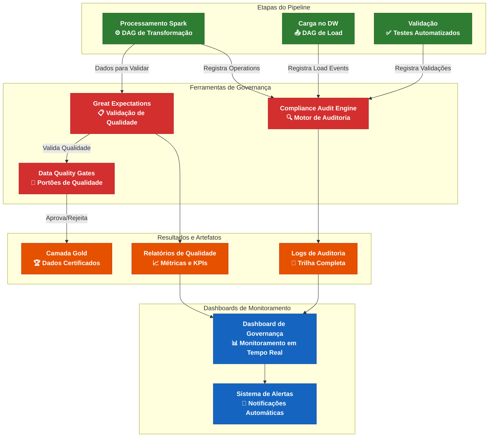

# Arquitetura de Dados Enterprise

## Resumo 

Esta documentação descreve a arquitetura da plataforma de dados, dividida em três visões principais para maior clareza: **Fluxo de Dados**, **Segurança** e **Governança**. Essa abordagem com múltiplas visões permite uma análise detalhada de cada pilar da solução, facilitando o entendimento, a manutenção e a evolução do projeto.

---

## 1. Visão Geral: Fluxo de Dados (Data Flow View)

### Objetivo
Este diagrama mostra o fluxo principal de valor, desde a ingestão dos dados de múltiplas fontes até a entrega de insights nos dashboards de BI. Ele representa a jornada do dado através das camadas da **Arquitetura Medallion**, focando na movimentação, transformação e enriquecimento progressivo dos dados.

### Características Principais
- **Arquitetura em Camadas**: Implementação do padrão Medallion (Bronze, Silver, Gold)
- **Orquestração Centralizada**: Apache Airflow para gerenciamento de pipelines
- **Múltiplas Fontes de Dados**: APIs externas e datasets estruturados
- **Entrega Multi-Canal**: Dashboards executivos e analíticos

---

## 2. Visão de Segurança (Security View)

### Objetivo
A segurança nesta arquitetura não é uma etapa, mas um **pilar transversal** que sustenta todo o processo. Este diagrama ilustra como os componentes do Framework de Segurança Customizado se integram e protegem o pipeline em pontos críticos.

### Componentes de Segurança
- **Enterprise Vault Manager**: Gerenciamento centralizado de credenciais e secrets
- **PII Protection Service**: Serviço de proteção e mascaramento de dados pessoais
- **Secure Connection Pool**: Pool de conexões seguras para todos os endpoints

### *"Como garantimos a confidencialidade, integridade e disponibilidade dos dados em cada etapa do fluxo?"*

---

## 3. Visão de Governança e Qualidade (Governance & Quality View)

### Objetivo
A confiança nos dados é o ativo mais valioso gerado por este pipeline. Esta visão detalha os mecanismos de **Governança e Garantia de Qualidade** implementados, mostrando como a validação automatizada e uma trilha de auditoria completa garantem a exatidão e conformidade dos dados.

### Componentes de Governança
- **Great Expectations**: Framework de validação e teste de qualidade de dados
- **Compliance Audit Engine**: Motor de auditoria e conformidade regulatória
- **Data Quality Gates**: Portões de qualidade automatizados no pipeline

### Benefícios
- **Confiabilidade**: Dados validados em cada etapa
- **Rastreabilidade**: Trilha completa de auditoria
- **Automação**: Validação sem intervenção manual
- **Conformidade**: Aderência às políticas de governança

---

## Tecnologias Utilizadas

### 🔧 **Orquestração e Processamento**
- **Apache Airflow**: Orquestração de pipelines e workflow management
- **Apache Spark**: Processamento distribuído de big data
- **Python**: Linguagem principal para desenvolvimento dos pipelines

### 🗄️ **Armazenamento**
- **MinIO**: Object storage para as camadas Bronze, Silver e Gold
- **PostgreSQL**: Data warehouse relacional com star schema
- **Redis**: Cache para otimização de performance

### 🔒 **Segurança**
- **HashiCorp Vault**: Gerenciamento de secrets e credenciais
- **Custom PII Service**: Mascaramento de dados pessoais
- **SSL/TLS**: Criptografia em trânsito

### 📊 **Visualização**
- **Grafana**: Dashboards executivos e monitoramento
- **Streamlit**: Interface analítica interativa
- **Great Expectations**: Documentação automática de dados

### 🌐 **Fontes de Dados**
- **API Banco Central**: Indicadores econômicos (IPCA, Selic)
- **API Meteorologia**: Dados climáticos em tempo real
- **Dataset Olist**: Dados transacionais de e-commerce

---
