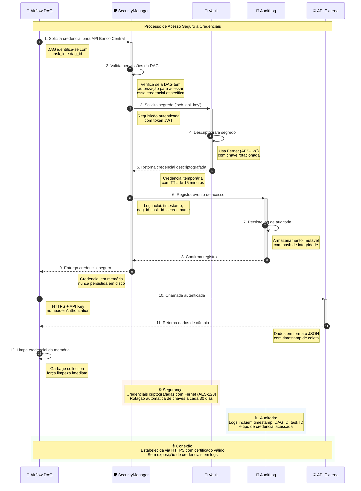

# Diagrama de Sequência: Acesso Seguro a Credenciais

## Cenário de Uso
**Situação:** Uma DAG do Airflow precisa acessar a API do Banco Central para coletar dados de câmbio. O diagrama ilustra como o framework de segurança garante acesso controlado e auditado às credenciais, demonstrando a implementação prática dos componentes de segurança em tempo de execução.

## Fluxo de Segurança
Este diagrama detalha o processo step-by-step de como as credenciais são solicitadas, validadas, entregues e auditadas, garantindo **zero-trust** e total rastreabilidade das operações.

---

## Componentes e Responsabilidades

### 🛡️ **SecurityManager**
- **Validação de Permissões**: Verifica se a DAG tem autorização para acessar credenciais específicas
- **Intermediação Segura**: Atua como proxy entre DAGs e o Vault
- **Controle de TTL**: Gerencia tempo de vida das credenciais temporárias
- **Rate Limiting**: Controla frequência de acessos por DAG

### 🔐 **Vault (HashiCorp Vault)**
- **Armazenamento Seguro**: Credenciais criptografadas com Fernet (AES-128)
- **Rotação Automática**: Chaves rotacionadas automaticamente a cada 30 dias
- **Auditoria Nativa**: Logs detalhados de todos os acessos
- **Políticas Dinâmicas**: Controle granular de acesso baseado em políticas

### 📝 **AuditLog**
- **Registro Imutável**: Logs com hash de integridade para prevenção de adulteração
- **Rastreabilidade Completa**: Tracking de qual DAG acessou qual credencial e quando
- **Compliance**: Atendimento aos requisitos de auditoria e governança
- **Alertas Automáticos**: Notificações em caso de acessos suspeitos

---

## Aspectos Técnicos de Segurança

### 🔐 **Criptografia**
- **Algoritmo**: Fernet (AES-128 em modo CBC)
- **Gestão de Chaves**: Rotação automática a cada 30 dias
- **Derivação**: PBKDF2 com salt único por credencial

### ⏱️ **Controle Temporal**
- **TTL de Credenciais**: 15 minutos para credenciais temporárias
- **Timeout de Sessão**: 5 minutos de inatividade
- **Renovação Automática**: Credenciais renovadas antes da expiração

### 🛡️ **Validação e Autorização**
- **RBAC**: Role-Based Access Control por DAG
- **JWT Tokens**: Autenticação baseada em tokens com expiração
- **IP Whitelisting**: Controle de acesso por origem

---

## Benefícios de Segurança

### ✅ **Princípios de Segurança Aplicados**
- **Zero-Trust Architecture**: Nenhum componente tem acesso direto às credenciais
- **Princípio do Menor Privilégio**: DAGs só acessam credenciais necessárias
- **Defense in Depth**: Múltiplas camadas de proteção
- **Fail-Safe Defaults**: Negação por padrão, acesso apenas com permissão explícita

### 📊 **Compliance e Auditoria**
- **Trilha de Auditoria Completa**: Registro de todas as operações
- **Conformidade LGPD**: Proteção de dados pessoais
- **SOX Compliance**: Controles financeiros adequados
- **ISO 27001**: Gestão de segurança da informação

### 🚀 **Operacional**
- **Alta Disponibilidade**: Vault em cluster com failover automático
- **Performance**: Cache inteligente de credenciais válidas
- **Monitoramento**: Métricas em tempo real de acesso e performance
- **Escalabilidade**: Suporte a milhares de DAGs simultâneas

---

## Cenários de Falha e Recuperação

### 🚨 **Tratamento de Erros**
1. **Vault Indisponível**: Fallback para cache local temporário
2. **Credencial Expirada**: Renovação automática transparente
3. **Acesso Negado**: Log de segurança e notificação aos administradores
4. **Falha de Rede**: Retry automático com backoff exponencial

### 🔄 **Procedimentos de Recuperação**
- **Backup de Credenciais**: Backup criptografado em storage seguro
- **Disaster Recovery**: Procedimentos documentados para restauração
- **Business Continuity**: Plano de continuidade para operações críticas
